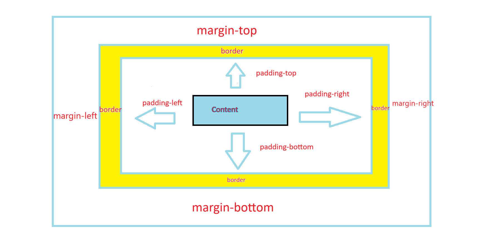

Quick Start:Usage example- Recreating a popular website
=======================================================

Let us try to understand how to use this library for web development
by creating the login page of Facebook. (It is to be noted that we are not going to create the exact
login page of Facebook as I am not sure if we are legally allowed to do so.Instead to be on the safer side,
we are only going to create a page that will only look very similar at first glance to the official 
Facebook's page, or in other words just a duplicate page)

This example explains how to go on with using this libary to first plan and then develop a site.
With that regards, I am going to first and foremost, vist the officail Facebbok login page as on December 4th 2024
to get an idea of what I am developing.

I see that it is a very simple site with 'facebook' written in dark bluish color towards the center and 
just below that, there is a certain text. So let's first create that. I have decided to use *bigger_heading* 
function for the "facebook" test and *paragraph* function for the bottom text.I will also apply color by 
passing the style dictionary as arguments to these functions ::

    from py4html import * #imports everything so that you can directly call functions by their names
    bigger_heading("facebook",style={"color":"blue","align":"center")
    paragraph('Facebook helps you connect and share with the people in your life.'style={"align":"center")

This is the equivalent html code generated in index.html file for the above Python code ::

    <!DOCTYPE html>
    <html>
    <head>
    
    </head>
    <body>
    <h2  style="color:blue; align:center; ">
    facebook
    </h2>
    

    Facebook helps you connect and share with the people in your life.
    

    </body>
    </html>

If you have tried this out, you will see that, this didn't work. The font type and color are wrong, but
more importantly, both the tests are appearing towards the top left instead of at center.So maybe, we cannot
align heading and paragraph directly to center and instead have to 
put it inside a division and then align that division to center(In fact if you open the index.html file in 
Vs code or any other advanced code editor, you will see that the align word is highlighted as unknown property).
So this is the code for that. ::

    from py4html import * 
    division_begins(style={"align":"center")
    bigger_heading("facebook",style={"color":"blue")
    paragraph('Facebook helps you connect and share with the people in your life.')
    division_ends()

But upon running this, you will see that it still doesn't work and in fact it will be shown by Vs code in 
the index.html file that there is no align property for division also. Now you have to get an undersatnding 
of how to center a division by doing a google search and refering the relevant websites.I have found this website
to be useful for some cases of applying css and this page linked `here <https://developer.mozilla.org/en-US/docs/Web/CSS/Layout_cookbook/Center_an_element>`_ offers a relatively clear explanation
of how to center something.So basically you need to create an outer division which serves like a container to the
items inside it.Then to center the inner division inside it, that has our heading and paragraph text,we need to
first turn the outer container division into a flex container by setting its display property to flex.Then we
also need to set align-items property to center for vertical centering (on the block axis) and justify-content
property to center for horizontal centering (on the inline axis).All the property changes are for the outer
container division only.

But upon running this, you will again see css living up to its reputation of not doing what it is supposed to 
do by not centering the inner division on both axis correctly.The reason this happens is because you have not
specified the size for the two divisions in the form of width and height and hence css will assume the outer 
container divsion to be only as long as the inner division and thereby resulting in only horizontal centering.
So just specify a width of 1000px and height 800px for the outer container and maybe 500px width and height 
for inner division.By this time, you would have also realised that the official facebook sites 'facebook' text
is off bigger size than that produced by bigger_heading() function, so you should use biggest_heading() to make
it more similar.But even then, you will notice the size difference for both heading and the paragraph test 
below from theones on official site and to overcome that you need to change the font-size property for 
both texts.And to get the correct spacing between the facebook text and the description text below,
you need to adjust the margin properties for both the texts. For this you need to get an undersatnding
of how padding,margin and border properties work in css.If you can't understand it properly by refering the
image given below, then you can read more `here <https://www.w3schools.com/css/css_boxmodel.asp>`_ basically
the padding properties for an element like divsion are for deciding the spacing between objects inside that
division and margin properties are for for deciding the spacing between this particular division and its 
enclosing outer division or any other container which can be the entire web page area itself.

FInally the complete code for the two texts looks like this::

    from py4htmlpc import * #imports everything so that you can directly call functions by their names

    division_begins(style={"display":"flex","align-items":"center","justify-content":"center",
                        "width":"1000px","height":"800px"})
    division_begins(style={"width":"500px","height":"500px"})
    biggest_heading("facebook",style={"color":"blue","font-size":"80px","margin-bottom":"5px"})
    paragraph('Facebook helps you connect and share with the people in your life.',
            style={"font-size":"30px","margin-top":"5px"})
    division_ends()
    division_ends()

And this is the generated equivalent html code ::

    <!DOCTYPE html>
    <html>
    <head>
    
    </head>
    <body>
    

    

    <h1  style="color:blue; font-size:80px; margin-bottom:5px; ">
    facebook
    </h1>
    

    Facebook helps you connect and share with the people in your life.
    

    

    

    </body>
    </html>
