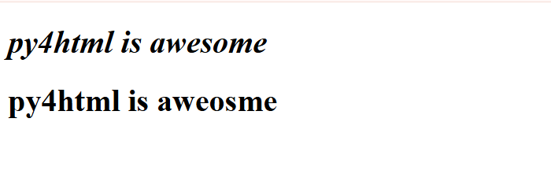
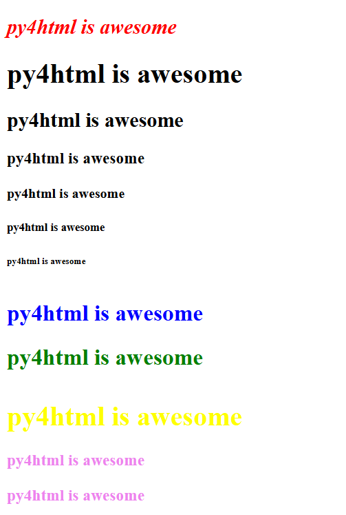
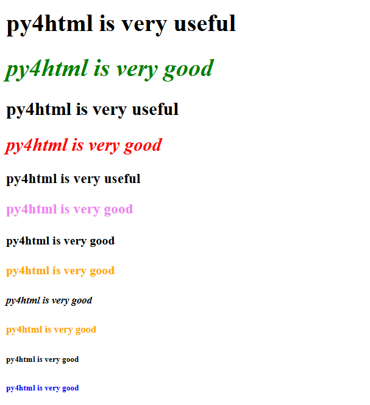

Headings
========

The **heading() function** can produce headings or large size text of various sizes that can be used as the title of a web page
just as the "Headings" word at the top is the title for this page.This function generates the heading tags
h1,h2,h3,h4,h5,h6 in Html(`more info <https://www.w3schools.com/html/html_headings.asp>`_)

**Formal Python definition**

.. py:function:: heading(text,num=1,text_type="",style={},id="",class_name="",attr_list=[])

   Gernerates headings of various sizes

   :param text: Required parameter of the text to be put as headings
   :type text: str
   :param num: Optional parameter of number deciding the heading size from biggest 1(for h1 tag) to 6(h6)
               for smallest,defaults to 1 or biggest heading
   :type num: int or None
   :param text_type: Optional parameter of what processing to apply to text such as bold,italics 
   :type text_type: str or None
   :param style: Optional parameter of style dictionary containing all styles to be applied to headings
                 in the form of key value pairs
   :type style: dict(str) or None
   :param id: Optional parameter for the id to be assigned to heading for applying styling or manipulating via
              javascript.It can be any randomly chosen string,  but it should be unique to the element
              or only id in a page. Accessed using # operator
   :type id: str
   :param class_name: Optional parameter for the class to be assigned to heading for applying styling or manipulating via
              javascript.It can be any randomly chosen string, and multiple html elements of different types can
              have same class names.Accessed using . operator
   :type id: str
   :param attr_list: Other than id or class, any other attribute can be applied to element by specifying as 
                     quoted strings separated by commas within a list. eg ['disabled'] for disabling a button
   :type id: list(str])
   :return: None
   :rtype: None

**Informal simple English defimition and Explanation**

Mandatory arguments are given in bold and rest are optional arguments which may be ommitted

heading(**text**,num=1,text_type="",style={})
   
This function requires a 'text' parameter in the form of a string of text to be passed to it, 
which will appear as large size text or heading like text, on the webpage.

The next optional argument of "num" determines what sized heading you want.This integer argument can be anything 
from 1 to 6, with the integer 1 resulting in the biggest size heading and the integer 6 giving the 
smallest possible heading.For those familiar with `html <https://www.w3schools.com/html/html_headings.asp>`_ ,
this is how you can use the differnet heading tags of h1 to h6.The default is 1, so if no argument is passed
for 'num' parameter, then it would result in the biggest size heading or equivalent h1 tag in html

The third optional argument of text_type decides what sort of transforamtion such as **bold** or *italics*
has to apllied to the heading text displayed on the webpage.The following table gives the different strings
that can be passed as text_type argument followed by a brief explanation of what it does. `the html explanation
can be found here <https://www.w3schools.com/html/html_formatting.asp>`_

================   ============================================
Argument strings   Function
================   ============================================
bold               **Makes the text bold**
italics            *makes the text italics*
important          Important text(equivalent of strong in html)
emphasized         Emphasized text
mark               Marked text
small              Smaller text
deleted            Deleted text
inserted           Inserted text
sub                Subscript text
sup                Superscript text
================   ============================================

As an example,this is how the two different headings would look ::

   from py4htmlpc import *

   heading("py4html is awesome",text_type="italics") #no argument for num and hence it defaults to 1 or biggest size
   heading("py4html is aweosme")

A very important point while passing arguments to py4html functions
-------------------------------------------------------------------

**One very important point to note here, as well as while using all functions in py4html is that the order
of arguments matters the most. In the first case, becuase we are omiting the num argument, it is mandatory to 
pass the text_type argument as text_type ="italics" itself and simply passing "italics" will not produce
any errors in your IDE, but it will lead to undesirable, wierd and wrong results.The first argument is 
the text to be put in heading which cannot be avoided and so you need not pass it as "text=" and instead can 
just pass the string of text as the first argument,but for all other arguments unless you pass all arguments in
the exact order as given in function definition, you will need to pass each argument by calling their 
formal parameter names such as num=1 text_type="bold" and so on** 

Italics was chosen for the above example as you wont't notice any difference between bold and non-bold text
when it comes to headings. For headings, it seems that the only useful and commonly used transforamtion that you 
can apply is **"italics"**,everything else doesn't result in any difference.To apply the style, we will be 
passingcss property names and their corresponding values as key value pairs in a dictionary.There are many 
properties associated with each tag in html,for changing colors, there is "background-color" property which 
changes the color of entire body which can be the entire body of a web page or divisions.For changing color of 
text,thereis "color" property and sometimes for some tags, "font-color" property.For headings set of html tags 
or for the equivalent heading function in py4html,the color of the text can be changed by changing the
"color" property to the color of your choice.So the style dictionary just for changing color becomes like 
style={"color":"blue"} and so on. The code fragment shown below shows some examples of using the heading 
in various ways and the output produced id shown in the image below that.Note that in the first case, as
we are passing all arguments to heading function in the exact order it was defined, there is no need to 
pass arguments by calling thier names.But when we mess up that order, we have to call their indvidual names
like num=1,text_type='bold',style={"color":"yellow"} and so on ::

   from py4html import *
   heading("py4html is awesome",2,"italics",{"color":"red"})
   heading("py4html is awesome",num=1)
   heading("py4html is awesome",2)
   heading("py4html is awesome",3)
   heading("py4html is awesome",4)
   heading("py4html is awesome",5)
   heading("py4html is awesome",6)
   heading("py4html is awesome",text_type="sub",style={"color":"blue"})
   heading("py4html is awesome",text_type="sup",style={"color":"green"})
   heading("py4html is awesome",style={"color":"yellow"})
   heading("py4html is awesome",3,style={"color":"violet"})
   #same result as previous
   heading("py4html is awesome",num=3,style={"color":"violet"})

Alternative more simpler way of creating headings
-------------------------------------------------

There are also alternative heading functions available in py4html that acheives the same result, but their names
are more intuitive about their use such as biggest_heading() for the higest possible sized heading text,
smallest_heading() for the smallest possible heading text size, bigger_heading() for the one smaller than biggest,
smaller_heading() for the second smallest and so on. So while using these intuitively named functions,
there is no need to pass the "num" argument for deciding the size of the heading text. Every other argument is
exactly the same as heading() function defined above in the exact same order.The different available functions
along with the value of the num argument that it is used as a replacement for, and the equivalent heading 
tags in html are given in the table below.

================== ======  =========
Function name      num=    html tag
================== ======  =========
biggest_heading()  1       h1
bigger_heading()   2       h2
big_heading()      3       h3
small_heading()    4       h4
smaller_heading()  5       h5
smallest_heading() 6       h6
================== ======  =========

So if you need to use the smallest heading, you can call directly smallest_heading() 
function instead of calling heading() and passing num=6 to it

**Formal python definitions of all alternative functions**

.. py:function:: biggest_heading(text,text_type="",style={})

   Generates the biggest possible heading (equivalent to h1 in HTML).

   :param text: Required parameter of the text to be put as headings.
   :type text: str
   :param text_type: Optional parameter for text formatting, such as bold or italics.
   :type text_type: str or None
   :param style: Optional dictionary for additional CSS styling.
   :type style: dict(str) or None
   :return: None
   :rtype: None

.. py:function:: bigger_heading(text, text_type="", style={})

   Generates a heading of the second-largest size (equivalent to h2 in HTML).

   :param text: Required parameter of the text to be put as headings.
   :type text: str
   :param text_type: Optional parameter for text formatting, such as bold or italics.
   :type text_type: str or None
   :param style: Optional dictionary for additional CSS styling.
   :type style: dict(str) or None
   :return: None
   :rtype: None

.. py:function:: big_heading(text, text_type="", style={})

   Generates a heading of the third-largest size (equivalent to h3 in HTML).

   :param text: Required parameter of the text to be put as headings.
   :type text: str
   :param text_type: Optional parameter for text formatting, such as bold or italics.
   :type text_type: str or None
   :param style: Optional dictionary for additional CSS styling.
   :type style: dict(str) or None
   :return: None
   :rtype: None

.. py:function:: small_heading(text, text_type="", style={})

   Generates a heading of the third-smallest size (equivalent to h4 in HTML).

   :param text: Required parameter of the text to be put as headings.
   :type text: str
   :param text_type: Optional parameter for text formatting, such as bold or italics.
   :type text_type: str or None
   :param style: Optional dictionary for additional CSS styling.
   :type style: dict(str) or None
   :return: None
   :rtype: None

.. py:function:: smaller_heading(text, text_type="", style={})

   Generates a heading of the second-smallest size (equivalent to h5 in HTML).

   :param text: Required parameter of the text to be put as headings.
   :type text: str
   :param text_type: Optional parameter for text formatting, such as bold or italics.
   :type text_type: str or None
   :param style: Optional dictionary for additional CSS styling.
   :type style: dict(str) or None
   :return: None
   :rtype: None

.. py:function:: smallest_heading(text, text_type="", style={})

   Generates the smallest possible heading (equivalent to h6 in HTML).

   :param text: Required parameter of the text to be put as headings.
   :type text: str
   :param text_type: Optional parameter for text formatting, such as bold or italics.
   :type text_type: str or None
   :param style: Optional dictionary for additional CSS styling.
   :type style: dict(str) or None
   :return: None
   :rtype: None

The following examples will help you in understanding more about this alternative way of implementing headings

**Examples of alternative heading functions** ::

   biggest_heading("py4html is very useful")
   biggest_heading("py4html is very good",text_type="italics",style={"color":"green"})
   bigger_heading("py4html is very useful")
   bigger_heading("py4html is very good",text_type="italics",style={"color":"red"})
   big_heading("py4html is very useful")
   big_heading("py4html is very good",style={"color":"violet"})
   small_heading("py4html is very good")
   small_heading("py4html is very good",style={"color":"orange"})
   smaller_heading("py4html is very good",text_type="italics")
   smaller_heading("py4html is very good",style={"color":"orange"})
   smallest_heading("py4html is very good")
   smallest_heading("py4html is very good",style={"color":"blue"})

